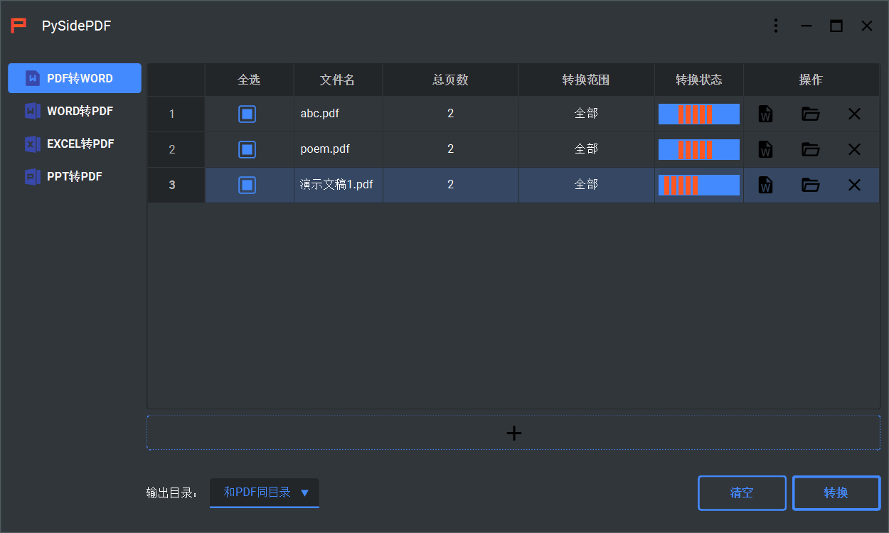
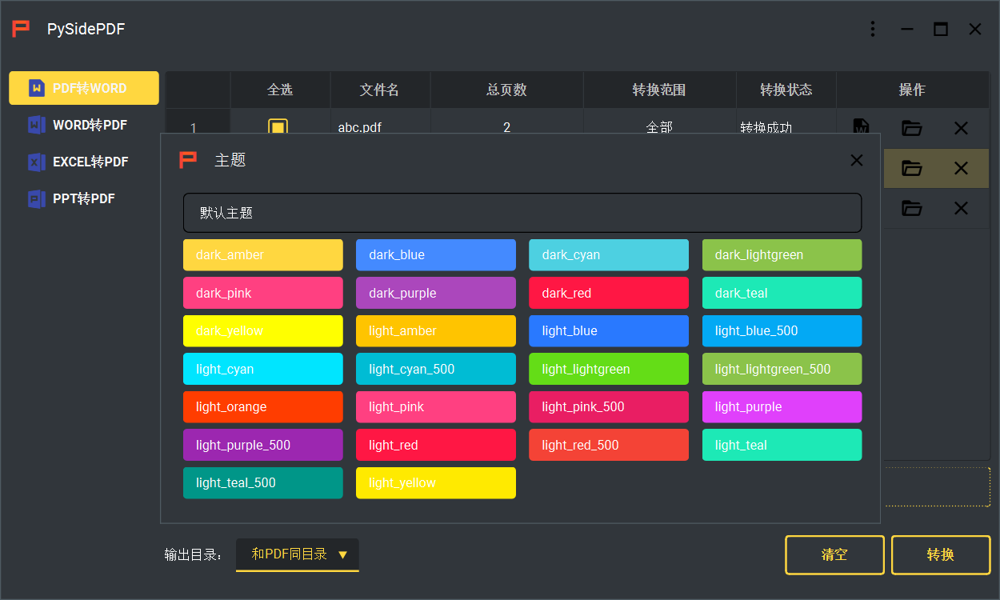

# PySidePDF

---

这是一个使用PySide6开发的用于转换PDF文档为Word文档的桌面程序。其中，界面基于开源库PySideFrameless，转换器基于开源库pdf2docx。支持多文档同时转换。

## 界面展示

* 主界面：
* 多主题：

## Getting Started

1. 安装依赖包:

   ```python
   pip install pyside6
   pip install qtawesome
   pip install qt_material==2.12
   pip install pdf2docx
   pip install pdfplumber
   pip install pypiwin32
   ```

2. 运行main.py脚本：

   ```python
   python main.py
   ```

## Dependencies

* [PySideFrameless](https://github.com/iounce/PySideFrameless)
* [pyside6](https://doc.qt.io/qtforpython/index.html)
* [pdf2docx](https://github.com/dothinking/pdf2docx)
* [pdfplumber](https://github.com/jsvine/pdfplumber)
* [qtawesome](https://github.com/spyder-ide/qtawesome)
* [qt_material](https://github.com/UN-GCPDS/qt-material)
